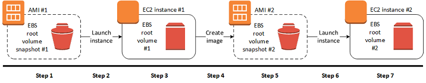
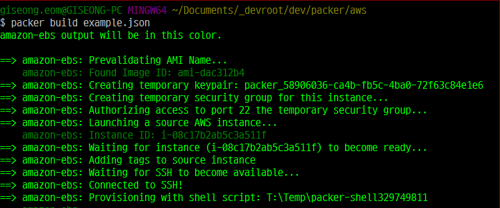
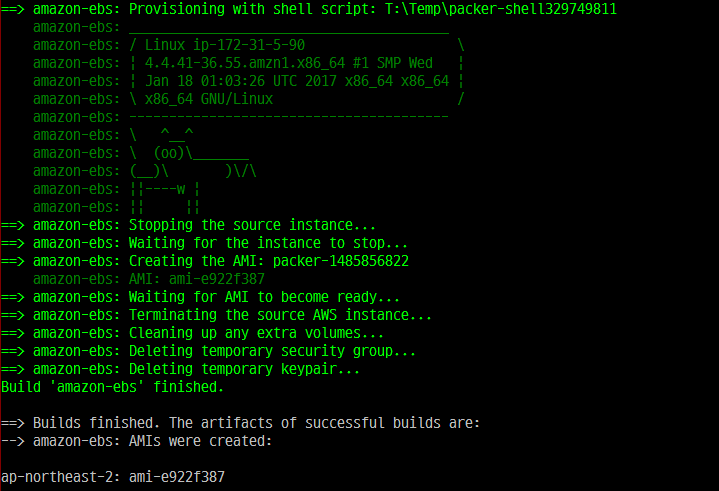
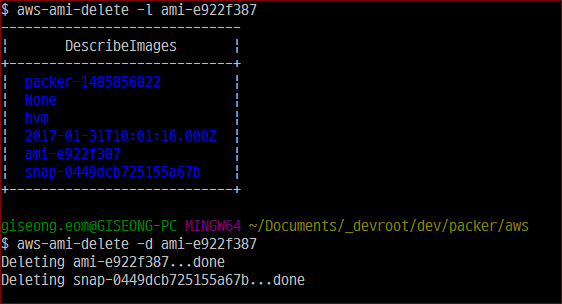

# Build Custom AMI with Packer

.footnote[엄기성 / awskrug 판교 중급자모임 / 2017.02 ]
???
* 제목, 발표자, 발표일 기재

---
## 발표자 소개

* 이름: 엄기성(GiSeong Eom)
* 회사: [블루홀(Bluehole)](https://www.bluehole.net/)
* 업무: Sysadmin, Infra Operation (2000.10 ~ )

---
## Disclaimer

* 이 슬라이드의 내용은 전적으로 .red[**발표자 개인 의견**]입니다.
* 소속 부서, 고용주의 정책/의견과 무관함을 미리 밝혀 둡니다.
???
* 면책 사항

---
## 목차

- Custom AMI 사용 배경
- packer 선택한 이유
- packer 기초
- 팁

---
## Custom AMI

* 어떤 환경이든 Customized OS 설치에 대한 욕구는 항상 존재함
* 빠른 배포 
  * Launch 및 Application 배포 시간을 단축
  * AutoScaling Group에서 특히 중요
* 일관성 유지
???
* 가능하다면 안 쓰는 것이 좋다고 생각함
* Thin Image vs Thick Image 언급

---
## Custom AMI 생성 과정



* 단순하게 표현하면
  1. EC2 launch
  2. snapshot 및 volume 생성
  3. 반복....


---
## AMI build with AWS tool

* 웹 관리 콘솔
* CLI 도구
  * AWS CLI
  * AWS Tools for Windows PowerShell


---
## AMI build with AWS tool (cont'd)


???
* 웹 콘솔은 답이 아님
* 다수의 스크립트를 유지보수하는 부담감.
  * 대안 필요

---
## Packer

* VM image build에 최적화된 도구
* `Template`(.json) = `Builder`+ `Provisioner`

???
* 어떤 기능을 제공하는지 간단히

---
## Packer (cont'd)

* Template

???
* Builder

---
## Packer (cont'd)

* Builder

---
## Packer (cont'd)

* Provisioner

---
### AMI build with Packer
example.json

```json
{
  "builders": [
    {
      "type": "amazon-ebs",
      "source_ami": "ami-dac312b4",
      "instance_type": "t2.nano",
      "ssh_username": "ec2-user",
      "ami_name": "packer-{{timestamp}}",
      "region": "ap-northeast-2"
    }
  ],

  "provisioners": [
    {
      "type": "shell",
      "inline": [
        "sudo yum -y -q install cowsay lolcat",
        "sudo cowsay `uname -a`"
       ]
    }    
  ]
}
```

???
* 최소버전 소스(example.json)

---
### AMI build with Packer (cont'd)

Packer validate
* example.json 파일의 .red[**,**] 누락된 것을 확인


---
### AMI build with Packer (cont'd)

Packer build



???
* build time: 2분 20초 (단순 작업임에도 불구하고...)

---
### AMI build with Packer (cont'd)

Packer build



---
### AMI build with Packer (cont'd)


---
### Packer's pros and cons


---
### AMI build with Packer - Advanced


---
### AMI build with Packer - Advanced (cont'd)


---
## AMI management



---
## References

* Packer
  * [Packer](https://www.packer.io/)
  * [`Packer build example.json` (Youtube)](https://goo.gl/SH74g1)
* Hashicorp
  * [DevOps Defined](https://www.hashicorp.com/devops.html#package)
* AWS Docs
  * [Creating an Amazon EBS-Backed Linux AMI](https://goo.gl/F7tEGV)

---
# Any Questions ?
