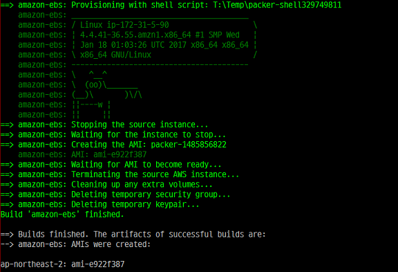

# Build Custom AMI with Packer

.footnote[엄기성 / awskrug 판교 소모임 / 2017.02.09 ]
???
* 제목, 발표자, 발표일 기재

---
## 발표자 소개

* 이름: [엄기성(GiSeong Eom)](mailto:jurist@kldp.org)
* 회사: [블루홀(Bluehole)](https://www.bluehole.net/)
* 업무: Sysadmin, Infra Operation (2000.10 ~ )

---
## Disclaimer

* 이 슬라이드의 내용은 전적으로 .red[**발표자 개인 의견**]입니다.
* 소속 부서, 고용주의 정책/의견과 무관함을 미리 밝혀 둡니다.
???
* 면책 사항

---
## 목차

- Custom AMI 사용 배경

- Custom AMI 생성

- Packer 소개

- 팁

---
# Custom AMI 사용 배경
---
## Custom AMI란 무엇인가?

* 공개된 AMI + 독자적인 설정/패키지 설치
* 기본적으로는 생성한 AWS root 계정에서만 사용가능.
* 권한을 변경해서 외부에 공개 가능함.  
* 3rd party AMI에 대해서 AWS가 무결성, 보안을 보장하지 않음

???
* Custom AMI


---
## Custom AMI의 장점

* 빠른 배포 
  * Launch 및 Application 배포 시간을 단축
  * AutoScaling Group에서 특히 중요


* 일관성 유지
  * 마이너 업그레이드의 경우에도 호환성 문제가 생길 수 있음
  * in-house Application도 호환성 문제 생길 수 있음

???
* 빠른 배포 -  Tomcat, 3rd party Agent 설치
* 일관성 - JDK 버전


---
## Custom AMI의 단점

* 지속적인 버전관리 부담


* 서비스 종류가 많으면, 관리부담이 선형적으로 증가
  * 이미지 관리 전략을 잘 가져가야 함 
  * Thin Image vs Thick Image

???
* 가능하다면 안 쓰는 것이 좋다고 생각함
* 자동화된 빌드가 가능할 때만 사용하는 것이 좋다고 생각
* Thin Image vs Thick Image 언급


---
# Custom AMI 생성
---
## Custom AMI 생성 과정


* 단순하게 표현하면
  1. EC2 instance 실행
  2. Customization
  3. Custom AMI 생성
  4. 전 단계의 Image로 EC2 instance 실행
  5. 반복....


---
## AWS CLI 이용한 AMI 빌드

* Amazon 제공 AMI로 EC2 instance 실행

```bash
aws ec2 run-instances \
  --image-id ami-dac312b4 \
  --count 1 \
  --instance-type t2.nano \
  --key-name vagrant
```

* 새로 실행된 EC2의 public IP주소를 확인, ssh 이용해서 패키지 설치

```bash
aws ec2 describe-instances \
  --instance-ids i-0e97acd9de5283a9d \
  --query 'Reservations[].Instances[].[PublicIpAddress,KeyName]'

ssh -i ~/.ssh/vagrant ec2-user@52.79.174.90 \
  "sudo yum -y -q install cowsay lolcat"
```


---
## AWS CLI 이용한 AMI 빌드 (cont'd)

* AMI Image 생성

```bash
aws ec2 create-image \
  --instance-id i-0e97acd9de5283a9d
  --name "exampleAMI"
```

* 방금 생성한 AMI의 Image ID 확인

```bash
aws ec2 describe-images \
  --owners self
  --query 'Images[].[Name,ImageId,CreationDate]' 
```

---
## AWS CLI 이용한 AMI 빌드 (cont'd)

* 확인된 Image ID 이용해서 새로운 EC2 instance 실행

```bash
aws ec2 run-instances \
  --image-id ami-47944429 \
  --count 1 \
  --instance-type t2.nano \
  --key-name vagrant

ssh -i ~/.ssh/vagrant ec2-user@52.79.186.35 \
  "sudo cowsay \`uname -a\` | lolcat"
```


---
## AWS CLI 이용한 AMI 빌드 (cont'd)

작업 정리하면 

1. public AMI 검색
1. EC2 instance 실행
1. EC2 instance 정보 조회
  * AMI customization 작업
1. AMI Image 생성
1. AMI 정보 조회 (Image Id)
1. AMI ID를 이용해서 EC2 instance 실행


**다수의 스크립트 작성 & 유지보수 부담** - [대안](https://www.packer.io)이 필요하다고 판단

???
* 팀 동료는 1명 (총 2명)

---
# Packer 소개
---
## Packer


* https://packer.io
* 최신 버전: **0.12.2**
* Hashicorp에서 개발, 공개한 오픈소스 도구 (go 언어로 개발)
* VM image build에 최적화
* 소스 `Template` = `Builder`+ `Provisioner` 로 구성


???
* 어떤 기능을 제공하는지 간단히

---
## Packer (cont'd)

Template

* 다양한 Machine 이미지를 단일 소스에서 생성할 수 있다.
* 파일 포맷: `.json`
* 필수 구성요소: **builders**


---
## Packer (cont'd)
Builder 

* 특정 플랫폼의 VM Image 생성을 도와주는 Packer 컴포넌트
* Amazon EC2 (AMI), Azure, Google, Hyper-V, Docker 등 18개의 Builder 제공
* Amazon EC2 (AMI)는 가장 처음부터 지원되었던 Builder이고, 안정적임

```json
  "builders": [
    {
      "type": "amazon-ebs",
      "access_key": "...",
      "secret_key": "..."
    }
]
```

---
## Packer (cont'd)
Provisioner

* Customization 작업을 도와주는 Pakcer 컴포넌트
* PowerShell, shell script, Chef, Puppet 등을 사용할 수 있다.

```json
"provisioners": [
  {
    "type": "windows-shell",
    "scripts": [
        "./scripts/run-sysprep.cmd"
    ]
  }   
]
```


???
* AWS, Azure RM을 공식지원 / terraform & packer


---
## AMI build with Packer
example.json

```json
{
  "builders": [
    {
      "type": "amazon-ebs",
      "source_ami": "ami-dac312b4",
      "instance_type": "t2.nano",
      "ssh_username": "ec2-user",
      "ami_name": "packer-{{timestamp}}",
      "region": "ap-northeast-2"
    }
  ],

  "provisioners": [
    {
      "type": "shell",
      "inline": [
        "sudo yum -y -q install cowsay lolcat",
        "sudo cowsay `uname -a`"
       ]
    }    
  ]
}
```

???
* 최소버전 소스(example.json)

---
## AMI build with Packer (cont'd)

Packer validate
* example.json 파일의 .red[**,**] 누락된 것을 확인


---
## AMI build with Packer (cont'd)

Packer build


???
* build time: 2분 20초 (단순 작업임에도 불구하고...)

---
## AMI build with Packer (cont'd)

Packer build



* 최종 산출물(build artifact): **ami-e922f387** 

---
## AMI build with Packer (cont'd)

주의사항

* .json 파일 편집이 용이한 편집기를 사용할 것
* provision 단계에서 한 번이라도 실패(return code)하면 build 실패


???
* build 단계가 늘어남에 따라 주의

---
# Tip
---
## source_ami 

* 예제 소스에서는 `source_ami` 가 하드코딩되어 있다.
* Amazon AMI는 계속 업데이트되므로 AMI ID도 변경된다. 

```json
{
  "builders": [
    {
      ".... 중복코드 생략 ..."
      "source_ami": "ami-dac312b4",
    }
  ],
```

.red[**유지보수 이슈 발생!!!**]

???
* 은근 귀찮음

---
## source_ami (cont'd)

* `source_ami_filter` 를 사용한다.

example2.json

```json
  "builders": [
    {
      ".... 중복코드 생략 ..."
      "source_ami_filter": {
        "filters": {
          "virtualization-type": "hvm",
          "architecture": "x86_64",
          "name": "amzn-ami-hvm-*",
          "block-device-mapping.volume-type": "gp2",
          "root-device-type": "ebs"
        },
        "owners": ["amazon"],
        "most_recent": true
      },      
    }
  ],
```

---
## source_ami (cont'd)

* build 하면 자동으로 이미지 검색되는 것 확인


???
* 형제(?) product인 terraform의 data source 기능도 언급


---
## variables

* 예제 소스에서 `instance_type`, `ssh_username`, `region` 이 하드코딩.
* Production 환경은 가변적이므로 사용 불가.

```json
  "builders": [
    {
      ".... 중복코드 생략 ..."
      "instance_type": "t2.nano",
      "ssh_username": "ec2-user",
      "region": "ap-northeast-2"
    }
  ],
```

.red[**유지보수 이슈 발생!!!**]

???
* 하드코딩은 너/나/우리의 적.

---
## variables (cont'd)

* Shell 환경변수, 사용자 변수(variables)를 적극 이용.

example3.json

```json
{
  "variables": {
    "aws_region": "{{env `AWS_DEFAULT_REGION`}}"
  },

  "builders": [
    {
      ".... 중복코드 생략 ..."
      "instance_type": "{{user `aws_ec2_type`}}",
      "ssh_username": "{{user `aws_ec2_user`}}",
      "region": "{{user `aws_region`}}"
    }
  ],
}
```


---
## variables (cont'd)

* 사용자 변수에 저장될 내용은 별도 파일로 분리

packer-var.json

```json
{
    "aws_ec2_type": "t2.nano",
    "aws_ec2_user": "ec2-user"
}
```


---
## variables (cont'd)

* packer build 도움말
* `-var-file` 옵션을 사용할 수 있다.


* packer validate & build

```
packer validate -var-file=packer-var.json example3.json
packer build    -var-file=packer-var.json example3.json
```

---
## ami_regions

* 예제 소스에서는 단일 region에서만 사용할 것을 전제함.
* 멀티 리젼 환경이 대부분인 요즘 문제가 된다.


```json
  "builders": [
    {
      ".... 중복코드 생략 ..."
      "region": "{{user `aws_region`}}"
    }
  ],
```

.red[**유지보수 이슈 발생!!!**]

???
* AWS CLI로 쉽게 할 수 있긴 하다.

---
## ami_regions (cont'd)

* ami_regions 설정을 이용해서 빌드 후, 다중 리젼에 복사

example4.json

```json
{

  "builders": [
    {
      ".... 중복코드 생략 ..."
      "region": "{{user `aws_region`}}",
      "ami_regions": [
        "ap-northeast-1",
        "ap-northeast-2"
      ]
    }
  ],
}
```


---
## ami_regions (cont'd)

* build 완료된 다음, 이미지 복사 진행되는 것을 확인


---
## 미사용 AMI 삭제

* AMI ID에 연결된 snapshot Id를 먼저 확인

```bash
aws ec2 describe-images \
 --image-ids ami-5c9a4a32 \
 --query 'Images[].BlockDeviceMappings[].Ebs[].SnapshotId'\
 --output text

snap-0b0f0d168161b67aa
```

* AMI를 de-register

```bash
aws ec2 deregister-image --image-id ami-5c9a4a32
```

* Snapshot 삭제

```bash
aws ec2 delete-snapshot --snapshot-id snap-0b0f0d168161b67aa
```

---
## 미사용 AMI 삭제 (cont'd)

* AWS CLI 호출하는 [bash functions](https://github.com/giseongeom/aws-toolkit/blob/master/linux/.bash_functions_aws) 사용


---
## Amazon AMI Update Notification

Amazon Linux AMI Notifications (2016.09.1 Release 부터 지원됨)

`arn:aws:sns:us-east-1:137112412989:amazon-linux-ami-updates`

Amazon Windows AMI Notifications 

`arn:aws:sns:us-east-1:801119661308:ec2-windows-ami-update`


---
# Any Questions?

.footnote[발표자료/예제소스 [다운로드](https://github.com/giseongeom/presentations/tree/master/2017/2017.02.09-AWS-pangyo-mid) ]


---
## References

* [패커(Packer)로 도커(Docker) 이미지 빌드 및 AMI 자동 빌드 시스템 구축](http://blog.remotty.com/blog/2015/09/30/paekeopackerro-dokeodocker-imiji-bildeu-mic-ami-jadong-bildeu-siseutem-gucug/)
* Packer
  * [PACKER](https://www.packer.io/)
  * [PACKER TERMINOLOGY](https://www.packer.io/docs/basics/terminology.html)
* Hashicorp
  * [DevOps Defined](https://www.hashicorp.com/devops.html#package)
* AWS Docs
  * [Creating an Amazon EBS-Backed Linux AMI](https://goo.gl/F7tEGV)
  * [Subscribing to Windows AMI Notifications](http://docs.aws.amazon.com/AWSEC2/latest/WindowsGuide/windows-ami-version-history.html#subscribe-notifications)
  * [Amazon Linux AMI 2016.09 Release Notes](https://aws.amazon.com/amazon-linux-ami/2016.09-release-notes/)

