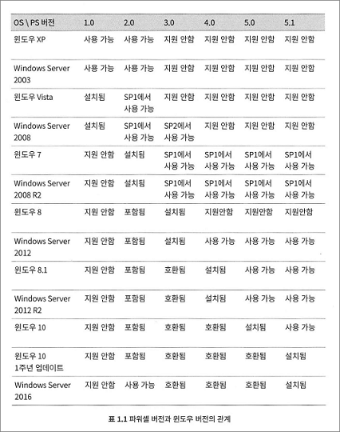
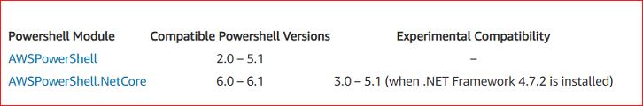

# AWS Tools for PowerShell (Core)

.footnote[엄기성 / AWSKRUG .red.bold[CLI] 소모임 / 2019.09.03 ]
???
* 제목, 발표자, 소속, 발표일 기재

---
## 발표자 소개

* 이름: 엄기성(GiSeong Eom)
* 회사: 판교 K모 게임회사
* 업무: Cloud/Infra Operation (a.k.a. Ops)
* 취미: https://github.com/giseongeom
* 활동
  * AWSKRUG CLI 소모임
  * AWSKRUG 판교 소모임
???
* 발표자 개인정보를 간략하게 기재

---
## Disclaimer

* 이 슬라이드의 내용은 전적으로 .red[**발표자 개인 의견**]입니다.
* 소속 부서, 고용주의 정책/의견과 무관함을 미리 밝혀 둡니다.
???
* 면책 사항

---
## 목차

- PowerShell Core 소개


- AWS Tools for PowerShell Core


- (간단) Demo


???
TOC

---
# PowerShell Core 소개
---
## (Legacy) Windows PowerShell

출처 - .red[실무에서 바로 쓰는 파워셸]
???
* Windows 버전의 Legacy PowerShell 버전 History를 1페이지로 요약
* Windows Server 2019에서도 동일하다는 점을 설명
---
## PowerShell Core

* Linux/Windows/MacOS 이기종 환경을 지원 (x86이외에도 arm 지원)


* .Net Core 2.x based


* 오픈소스:  https://github.com/PowerShell/PowerShell


* 6.0 : 2018.01.10 발표됨


* 6.2 : 2019.03.28 발표됨
  * Latest: 6.2.2 (Stable)


* 7.0 : 2019.04.30 발표됨
  * Latest: 7.0.0-preview.3 (Preview)
  * .Net Core 3.0 based
  * .Net Core 3.0 정식 버전이 발표되면 이어서 발표될 것으로 예상함
  * 제품명에서 `Core` 제거 예정


---
# AWS Tools for PowerShell
---
## AWS Tools for Windows PowerShell

* Module Name: [`AWSPowerShell`](https://www.powershellgallery.com/packages/AWSPowerShell/)


* .MSI installer로 제공되고 있음


* Windows PowerShell 3.0 이하의 Legacy 환경에서만 사용하는 것이 좋다.


```Powershell
WARNING
AWSPowerShell.NetCore is the suggested version for all systems
running PowerShell 3.0+ with .NET Framework 4.7.2+ or PowerShell
6.0+. AWSPowerShell is the legacy module for older systems which
cannot be updated to PowerShell 3.0+ with .NET Framework 4.7.2+
or to PowerShell 6.0+.
```

---
## AWS Tools for PowerShell Core


* Module Name: [`AWSPowerShell.NetCore`](https://www.powershellgallery.com/packages/AWSPowerShell.NetCore/)


* Microsoft가 PowerShell 6.0 발표한 그 다음날 정식지원 발표함.
  * 2018.01.10: [PowerShell Core 6.0: Generally Available (GA) and Supported!](https://devblogs.microsoft.com/powershell/powershell-core-6-0-generally-available-ga-and-supported/)
  * 2018.01.11: [AWS Support for PowerShell Core 6.0](https://aws.amazon.com/blogs/developer/aws-support-for-powershell-core-6-0/)


* Windows Powershell과 Powershell Core에서 .red[**호환됨!!!!!**]
  * [PowerShell Standard support in AWSPowerShell.NetCore](https://aws.amazon.com/blogs/developer/powershell-standard-support-in-awspowershell-netcore/)




---
# Demo
---
## JMESPath, jq 싫어요

* AWS CLI

```bash
aws ec2 describe-images --owner amazon --query \
  "Images[?starts_with(Name, 'amzn2-ami-hvm-2.0')] \
  | sort_by([], &CreationDate) \
  | reverse([])[0].[Name,Description,ImageId,CreationDate]"
```

* AWS Tools for PowerShell

```PowerShell
Get-EC2Image -Owner amazon |
  Where-Object { $_.name -like "amzn2-ami-hvm-2.0*" } |
  Sort-Object -Property CreationDate -Descending |
  Select-Object -First 1 -Property Name,Description,ImageId,CreationDate
```

---
## JMESPath, jq 싫어요  (cont'd)


* AWS CLI

```bash
aws ec2 describe-security-groups \
  --query "SecurityGroups[?VpcId=='vpc-b01433d4'] | [?contains(Description, 'Demo')]"
```


* AWS Tools for PowerShell

```PowerShell
Get-EC2SecurityGroup |
 where-object {
   ($_.VpcId -eq 'vpc-b01433d4') -and ($_.Description -like "*Demo*")
 }
```

---
## JMESPath, jq 싫어요  (cont'd)

* AWS CLI

```bash
aws ec2 describe-instances \
  --query "Reservations[].Instances[].[PublicIpAddress,State.Name]" --output table
```

* AWS Tools for PowerShell

```PowerShell
(Get-EC2Instance).Instances |
  format-table -AutoSize PublicIpAddress,@{l='State';e={$_.State.Name}}
```

---
## 작업 환경

* Windows 10 1903


* Windows Subsystem for Linux v1
  * Ubuntu 18.04
  * Amazon Linux 2


* PowerShell Core 6.2.2
  * PowerShell 7.0.0-Preview.3


* AWSPowerShell.NetCore 3.3.531.1


---
## 정리

* Interactive 작업환경으로 `PowerShell Core`를 고려하자.
* AWS Tools for PowerShell module은 모든 PowerShell 환경에서 사용할 수 있다.
* `JMESPath`, `jq` Query에 집착하지 말자.

---
# Any Questions?

.footnote[발표자료/예제소스 [다운로드](https://github.com/giseongeom/presentations/tree/master/2019/2019.09.03-AWS-cli) ]

---
## References

* [실무에서 바로 쓰는 파워셸](http://www.yes24.com/Product/goods/59058752)
* [AWS Tools for Powershell](https://github.com/aws/aws-tools-for-powershell)
* [Setting up the AWS Tools for PowerShell Core on Linux or macOS X](https://docs.aws.amazon.com/powershell/latest/userguide/pstools-getting-set-up-linux-mac.html)
* [The Next Release of PowerShell – PowerShell 7](https://devblogs.microsoft.com/powershell/the-next-release-of-powershell-powershell-7/)
* [PowerShell Standard support in AWSPowerShell.NetCore](https://aws.amazon.com/blogs/developer/powershell-standard-support-in-awspowershell-netcore/)
* [PowerShell Standard](https://github.com/PowerShell/PowerShellStandard)
* [PowerShell Core 6.0: Generally Available (GA) and Supported!](https://devblogs.microsoft.com/powershell/powershell-core-6-0-generally-available-ga-and-supported/)
* [AWS Support for PowerShell Core 6.0](https://aws.amazon.com/blogs/developer/aws-support-for-powershell-core-6-0/)
* [General Availability of PowerShell Core 6.2](https://devblogs.microsoft.com/powershell/general-availability-of-powershell-core-6-2/)
* [PowerShell 7 Preview 3](https://devblogs.microsoft.com/powershell/powershell-7-preview-3/)
* [pwsh -Login support #10050](https://github.com/PowerShell/PowerShell/pull/10050)
* [PowerShell Core Support Lifecycle](https://docs.microsoft.com/en-us/powershell/scripting/powershell-support-lifecycle?view=powershell-6)
* [.NET Core Support Policy](https://dotnet.microsoft.com/platform/support/policy/dotnet-core)
* [AWS Tools for PowerShell Cmdlet Reference](https://docs.aws.amazon.com/powershell/latest/reference/)
* [AWS CLI Command Reference](https://docs.aws.amazon.com/cli/latest/index.html)
* [Install-Module prompting for untrusted repo when all repos are trusted](https://github.com/PowerShell/PowerShellGet/issues/353)
* [Modular version of AWS Tools for PowerShell released as preview #33](https://github.com/aws/aws-tools-for-powershell/issues/33)
* [JMESPath Tutorial](http://jmespath.org/tutorial.html)
* [Advanced AWS CLI JMESPath Query Tricks (2015/07)](https://opensourceconnections.com/blog/2015/07/27/advanced-aws-cli-jmespath-query/)